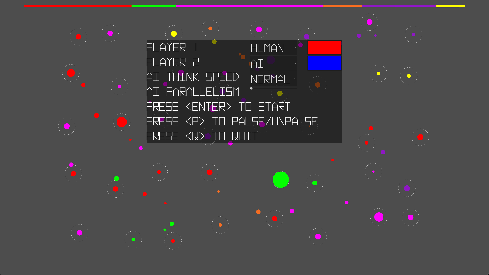

# blobfight

## Overview

A Godot recreation of an old Xwindows game from the dawn of time.



## How to run it

Download [The Godot Engine](https://godotengine.org/) and point it at this directory.

Left click to select a planet (shift to multi-select), right click to send the fleets.  Go get 'em!

## Built With
* The [The Godot Engine](https://godotengine.org/)
* [Hyperspace](https://www.pixelsagas.com/?download=hyperspace) - an awesome font from Pixel Sagas

## Authors

* **Luke Hankins** - [lukehankins](https://github.com/lukehankins)

## License
```
Please refer to LICENSE or <http://unlicense.org/>
```
